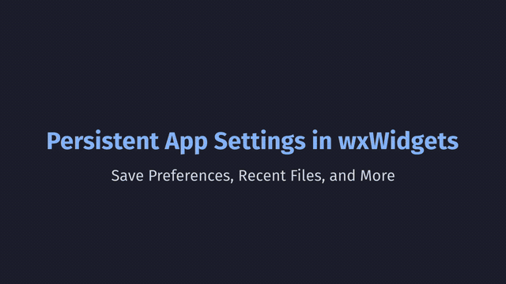

# wx_app_config_tutorial



Persistent App Settings in wxWidgets — saving preferences, recent files, and first-run detection using `wxFileConfig`.

This is the companion code for the [tutorial video](https://www.youtube.com/watch?v=rhm-XJCMsXo).

## Requirements

This works on Windows, Mac, and Linux. You'll need `cmake` and a C++ compiler (tested on `clang`, `gcc`, and MSVC).

Linux builds require the GTK3 library and headers installed in the system.

## Building

To build the project, use:

```bash
cmake -S . -B build
cmake --build build
```

To build in release mode:

```bash
cmake -S . -B build -DCMAKE_BUILD_TYPE=Release
cmake --build build --config Release
```

---
Check out the blog for more! [devmindscape.com](https://devmindscape.com)
---
